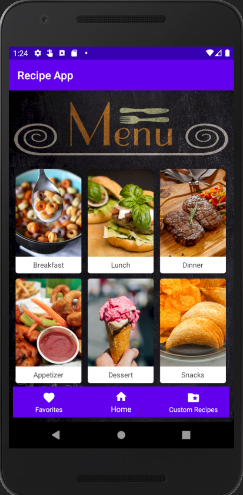
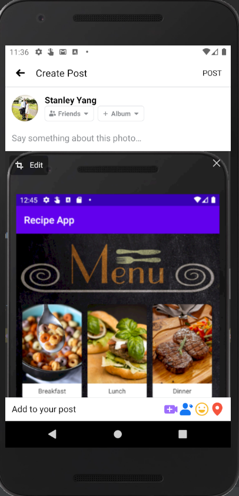
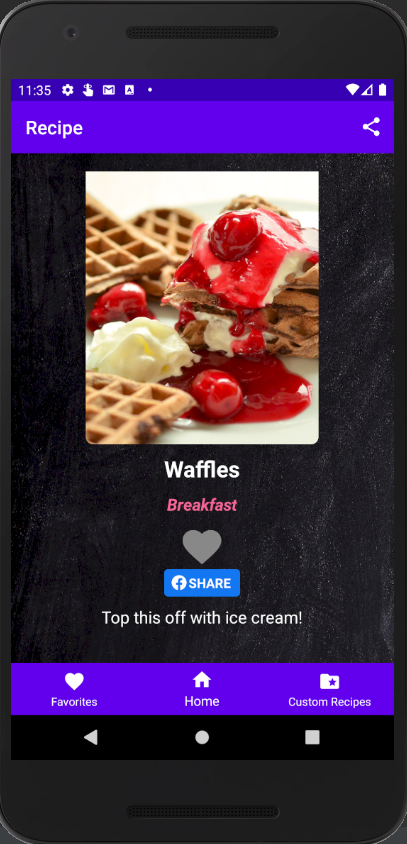
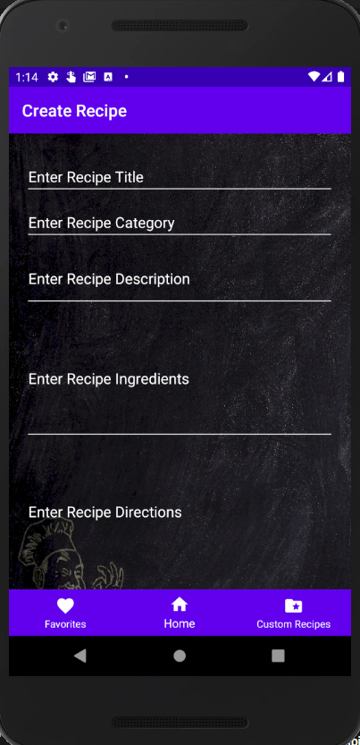

# Recipe App

This app is designed with predefined recipes including images, ingredients, and directions for the user to look up. The user also has the option of creating their own custom recipe.

## Setup
Building this project requires the knowledge of implementing recycler view for each activity that uses a grid of cardview images. 
Switching from one activity to another plays a major role for better user experience. Facebook Sharing SDK is also used in order for the app to be shared onto Facebook.

## Features

- Sharing capability

- Favoriting recipes

- Designing own custom recipes

Visit [Android Studio](https://developer.android.com/studio) and [Facebook Developer](https://developers.facebook.com/?no_redirect=1) for 
more on creating and sharing your own android project.

